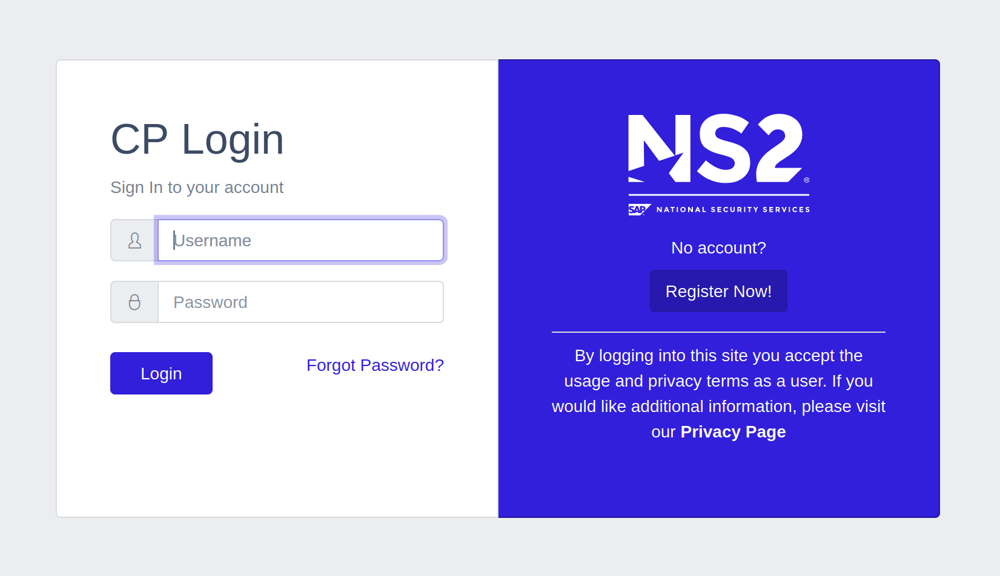

# cp-sso
[SAP Cloud Platform](https://www.sap.com/products/cloud-platform.html) deployable [Keycloak](https://www.keycloak.org/) secured sample system

## Keycloak container



### Build
* Requires a [PostgreSQL](https://www.postgresql.org/) backend.
  > This project was developed with a free tier [Amazon RDS](https://aws.amazon.com/rds/) instance.
* Run the build script to copy over the custom [CoreUI](https://coreui.io/ ) based theme
```bash
cd keycloak
./docker-build.sh
```
### Run
* Update `keycloak/docker-run.sh` to have the values for your PostgreSQL instance.
  >`PG_ADDR` and `PG_PASSWORD` are externalized to environment variables to avoid being checked into source control

```bash
cd keycloak
./docker-run.sh
```

### Development
* Make sure the keycloak container is running. Get the id of the running container from this command
```bash
docker ps -f ancestor=quay.io/mechevarria/keycloak-coreui | awk '{print $1}'
```
* Copy the over the theme directory from the container by replacing `$container` with the value from the previous command. The system themes are automatically ignored by git
```bash
docker cp $container:/opt/jboss/keycloak/themes keycloak/
```
* Build a development image (turns off caching of pages)
```bash
cd keycloak
./docker-build-dev.sh
```
* Run the development image (mount the local themes directory)
```bash
cd keycloak
./docker-run-dev.sh
```
* Changes made locally to `keycloak/themes` will be seen when you refresh server pages in your browser.

## Springboot Container

* Development tools are already integrated. To run use
```bash
mvn spring-boot:run
```